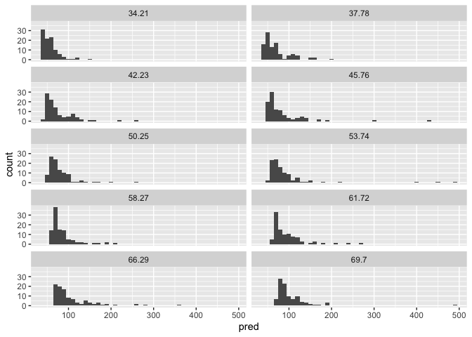

GLMs and link functions
================

A linear regression model is defined as follows:

*y*<sub>*i*</sub> = *β*<sub>0</sub> + *β*<sub>1</sub>*x*<sub>1*i*</sub> + *β*<sub>2</sub>*x*<sub>2*i*</sub> + ... + *β*<sub>*p*</sub>*x*<sub>*p**i*</sub> + *ε*<sub>*i*</sub>
 It has two components:

1.  **Explained variance:** This is the *β*<sub>0</sub> + *β*<sub>1</sub>*x*<sub>1*i*</sub> + *β*<sub>2</sub>*x*<sub>2*i*</sub> + ... + *β*<sub>*p*</sub>*x*<sub>*p**i*</sub> part. It is fixed/ constant. If we think of the model as a generative model, then every time we generate a data point for *i*, we get the same value.

2.  **Unexplained variance (or noise model)** This is the *ε*<sub>*i*</sub> part. It is a distribution. If we think of the generative model, then every time we generate a value for *i*, we sample from the distribution. In a standard regression model, this distribution is specified to be *N**o**r**m**a**l*(0, *σ*). If we now think of the model as being predictive and not generative, then the smaller the value of *σ*, the better our model because we don't rely as strongly on noise to explain our data.

Since the explained variance part is constant, the shape of the predicted distribution is determined by the shape of *ε*. Since in a standard regression, we assume that *ε* is of the form *N**o**r**m**a**l*(0, *σ*), then the model's predicted distribution is going to be of the form *N**o**r**m**a**l*(*P*, *σ*), where P is *β*<sub>0</sub> + *β*<sub>1</sub>*x*<sub>1*i*</sub> + *β*<sub>2</sub>*x*<sub>2*i*</sub> + ... + *β*<sub>*p*</sub>*x*<sub>*p**i*</sub>.

``` r
x1 <- c(1:10)
x2 <- rep(c(1,-1), 5)

y_lin <- 30 + 4*x1 + 0.2*x2 + 0.01*x1*x2 

num_samples = 100

# Normal noise
dat <- NULL
for(i in c(1:10)){
  rand =  
  dat <- rbind(dat, data.frame(i = y_lin[i], pred = y_lin[i] + rnorm(num_samples, 0, 25)))
}

hist(rnorm(num_samples, 0, 25))
```


``` r
ggplot(dat, aes(pred)) + geom_histogram(binwidth = 10) + facet_wrap(~i, ncol=2)
```


If on the other hand, we assume that *ε* is of the form *L**o**g**N**o**r**m**a**l*(0, *σ*) or *E**x**p**o**n**e**n**t**i**a**l*(*λ*), then the shape of the predicted distribution would be lognormal or exponential respectively.

``` r
# Log normal noise
dat <- NULL
for(i in c(1:10)){
  rand =  
  dat <- rbind(dat, data.frame(i = y_lin[i], pred = y_lin[i] + rlnorm(num_samples, 3)))
}

hist(rlnorm(num_samples, 3))
```


``` r
ggplot(dat, aes(pred)) + geom_histogram(binwidth = 10) + facet_wrap(~i, ncol=2)
```



``` r
# Exponential noise 
dat <- NULL
for(i in c(1:10)){
  rand =  
  dat <- rbind(dat, data.frame(i = y_lin[i], pred = y_lin[i] + rexp(num_samples, 1)))
}

hist(rexp(num_samples, 1))
```


``` r
ggplot(dat, aes(pred)) + geom_histogram(binwidth = 10) + facet_wrap(~i, ncol=2)
```


#### Non-linear generative process

In a standard regression model, we are assuming that the explained variance is driven by a linear combination of predictors. Changing that assumption, for example to assume that the predictors combine multiplicatively, will change the interpretation of *β* coefficients of the model, but will not change the shape of the predicted distribution -- because remember, the explained variance part of the model is fixed and cannot change the shape of the distribution.

``` r
y_exp <- exp(1)*exp(0.7*x1)*exp(0.02*x2)*exp(0.01*x1*x2) # = exp(1 + 0.7*x1 + 0.02*x2 + 0.01*x1*x2)
  

num_samples = 100


# Normal noise
dat <- NULL
for(i in c(1:10)){
  rand =  
  dat <- rbind(dat, data.frame(i = y_exp[i], pred = y_exp[i] + rnorm(num_samples, 0, 40)))
}

hist(rnorm(num_samples, 0, 25))
```


``` r
ggplot(dat, aes(pred))  + geom_histogram() +  facet_wrap(~i, ncol=2)
```

    ## `stat_bin()` using `bins = 30`. Pick better value with `binwidth`.


``` r
# Log normal noise
dat <- NULL
for(i in c(1:10)){
  rand =  
  dat <- rbind(dat, data.frame(i = y_exp[i], pred = y_exp[i] + rlnorm(num_samples, 5)))
}

hist(rlnorm(num_samples, 3))
```


``` r
ggplot(dat, aes(pred)) + geom_histogram() + facet_wrap(~i, ncol=2)
```

    ## `stat_bin()` using `bins = 30`. Pick better value with `binwidth`.


``` r
# Exponential noise 
dat <- NULL
for(i in c(1:10)){
  rand =  
  dat <- rbind(dat, data.frame(i = y_exp[i], pred = y_exp[i] + rexp(num_samples, 1)))
}

hist(rexp(num_samples, 3))
```


``` r
ggplot(dat, aes(pred)) + geom_histogram() + facet_wrap(~i, ncol=2)
```

    ## `stat_bin()` using `bins = 30`. Pick better value with `binwidth`.


#### Link functions

To recap, a standard regression model makes three assumptions:

1.  The predictive distribution is a **sum** of the explained and unexplained variance.
2.  Explained variance or the predictive part of the model is a linear combination of predictors.
3.  Unexplained variance or noise is normally distributed.

A GLM (*Generalized linear model*) allows us to change assumptions 2 and 3 by using **link functions**. For example, if we want to say that the predictors combine multiplicatively, we can achieve this by exponentiating the predicted value. Therefore we would use log as a link function for the predictor part. Similarly, if we wanted to say that the noise was exponentially distributed, then we would use log as a link function for the noise.

#### Modeling log(RTs)

The distribution of RTs is lognormal -- i.e. the log of RTs is roughly normally distributed. Since a standard regression model can only predict normal distributions, we cannot directly model RTs. A common solution is to model log(RTs) instead of RTs. When we do this, then we are basically assuming that **on the raw scale** both that the predictors combine multiplicatively *and* that the noise is exponentially (or more accurately lognormally) distributed.

**Question** Is this mathematically equivalent to having the link function of predictor and noise be log?

If we wanted to keep assuming that the predictors combine linearly, then we could just change the link function of the noise.
