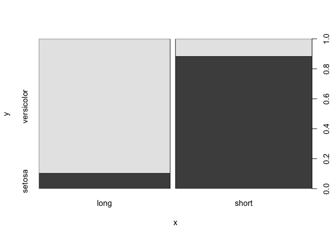

Regressions tutorial
================
Grusha Prasad
July 15, 2018

What is linear regression?
==========================

Linear regression allows us to describe the relationship between a dependent variable (y) and one or more independent variables (x). Unlike with correlation where we are interested in the extent to which x and y are related to each other, with regression we are specifically interested in predicting y from x - i.e. how much of the variance in y can be explained by grouping the data by x. Given this goal, people often talk about regression in terms of causation. For example consider the following equation:

*y* = 3*x* + 4

One way to describe this model: The model predicts that one unit increase in x causes/ is associated with 3 units increase in y. Therefore the coefficient of x is the degree to which x can impact y. This description has a causal flavour because it describes it as a difference within an individual or a group (i.e. how would the response of an indvidual change if they were given the 'treatment'). However Gelman and Hill argue that we should be thinking of regressions as a difference between individuals and groups.

> "Linear regression is a method that summarizes how the average values of a numerical outcome variable vary over subpopulations defined by linear functions of predictors." (pg 31)

Another way to describe the model: The model predicts that two groups that have a one unit difference in x on average tend to have two units difference in y. The coefficient of x is predicted *average difference* in y for groups that vary in x.

Brief description of the dataset
--------------------------------

``` r
data(iris)
summary(iris)
```

    ##   Sepal.Length    Sepal.Width     Petal.Length    Petal.Width   
    ##  Min.   :4.300   Min.   :2.000   Min.   :1.000   Min.   :0.100  
    ##  1st Qu.:5.100   1st Qu.:2.800   1st Qu.:1.600   1st Qu.:0.300  
    ##  Median :5.800   Median :3.000   Median :4.350   Median :1.300  
    ##  Mean   :5.843   Mean   :3.057   Mean   :3.758   Mean   :1.199  
    ##  3rd Qu.:6.400   3rd Qu.:3.300   3rd Qu.:5.100   3rd Qu.:1.800  
    ##  Max.   :7.900   Max.   :4.400   Max.   :6.900   Max.   :2.500  
    ##        Species  
    ##  setosa    :50  
    ##  versicolor:50  
    ##  virginica :50  
    ##                 
    ##                 
    ## 

There are 4 continuous variables and one categorical variable. In the remainder of this document we will predict the Petal.Length from the other variables.

Categorical predictors
======================

One predictor
-------------

Let us start by looking at just two species.

``` r
two_species <- subset(iris, Species != 'virginica')
two_species$Species <- factor(two_species$Species)  #removes ghost levels
lm(two_species$Petal.Length ~ two_species$Species)
```

    ## 
    ## Call:
    ## lm(formula = two_species$Petal.Length ~ two_species$Species)
    ## 
    ## Coefficients:
    ##                   (Intercept)  two_species$Speciesversicolor  
    ##                         1.462                          2.798

In order to understand what the intercept and the coefficients mean, it is important to understand how the contrasts are coded for the variable

``` r
contrasts(two_species$Species)
```

    ##            versicolor
    ## setosa              0
    ## versicolor          1

As a default, R uses dummy coding - which means that it treats one of the levels as a "baseline" and compares all the other levels with this baseline. (It picked 'setosa' as the basline because the levels were organized alphabetically)

With dummy coding with one predictor, the intercept is the mean petal length of the baseline category (i.e. setosa)

``` r
mean(subset(two_species, Species == 'setosa')$Petal.Length)
```

    ## [1] 1.462

The coefficient is the mean difference in petal length between baseline cateogry and the category it is being compared to.

``` r
mean(subset(two_species, Species == 'versicolor')$Petal.Length - subset(two_species, Species == 'setosa')$Petal.Length)
```

    ## [1] 2.798

The same idea applies when there are more than two levels to a predictor. There are if a variable has k levels, there are k-1 coefficients to estimate

``` r
lm(iris$Petal.Length ~ iris$Species)
```

    ## 
    ## Call:
    ## lm(formula = iris$Petal.Length ~ iris$Species)
    ## 
    ## Coefficients:
    ##            (Intercept)  iris$Speciesversicolor   iris$Speciesvirginica  
    ##                  1.462                   2.798                   4.090

``` r
contrasts(iris$Species)
```

    ##            versicolor virginica
    ## setosa              0         0
    ## versicolor          1         0
    ## virginica           0         1

The intercept is again the mean of the baseline (setosa)

``` r
mean(subset(iris, Species == 'setosa')$Petal.Length)
```

    ## [1] 1.462

The coefficients are the mean difference between the baseline and the cateogory that is being compared to the baseline

``` r
mean(subset(iris, Species == 'setosa')$Petal.Length - subset(iris, Species == 'versicolor')$Petal.Length)
```

    ## [1] -2.798

``` r
mean(subset(iris, Species == 'setosa')$Petal.Length - subset(iris, Species == 'virginica')$Petal.Length)
```

    ## [1] -4.09

Note, the dummy contrasts assumes we have a baseline level that we can compare the other levels with. This might be useful when thinking about treatment groups and control groups. However this is not always useful for other kinds of categorical variables. Instead we can use summed contrasts - which will allow us to compare the means for groups with the grand mean.

``` r
two_species$Species_sc <- two_species$Species
contrasts(two_species$Species_sc) <- "contr.sum"
contrasts(two_species$Species_sc)
```

    ##            [,1]
    ## setosa        1
    ## versicolor   -1

``` r
lm(two_species$Petal.Length ~ two_species$Species_sc)
```

    ## 
    ## Call:
    ## lm(formula = two_species$Petal.Length ~ two_species$Species_sc)
    ## 
    ## Coefficients:
    ##             (Intercept)  two_species$Species_sc1  
    ##                   2.861                   -1.399

The intercept (or the baseline we are comparing the group means to) in this case is the grand mean of petal length across species

``` r
mean(two_species$Petal.Length)
```

    ## [1] 2.861

The coefficient in this case is how much the average petal length of each species varies from the grand mean.

``` r
mean(two_species$Petal.Length) - mean((subset(two_species, Species == 'versicolor')$Petal.Length))
```

    ## [1] -1.399

``` r
mean(two_species$Petal.Length) - mean((subset(two_species, Species == 'setosa')$Petal.Length))
```

    ## [1] 1.399

When there are two conditions this is just half of the distance between the conditions we get with the 0,1 dummy coding. So if we wanted to have the same effect size we could set the contrasts to be -0.5 and 0.5 instead of 1 and -1.

Similarly looking at summed contrasts for three levels.

``` r
iris$Species_sc <- iris$Species
contrasts(iris$Species_sc) <- "contr.sum"
contrasts(iris$Species_sc)
```

    ##            [,1] [,2]
    ## setosa        1    0
    ## versicolor    0    1
    ## virginica    -1   -1

``` r
lm(iris$Petal.Length ~ iris$Species_sc)
```

    ## 
    ## Call:
    ## lm(formula = iris$Petal.Length ~ iris$Species_sc)
    ## 
    ## Coefficients:
    ##      (Intercept)  iris$Species_sc1  iris$Species_sc2  
    ##            3.758            -2.296             0.502

``` r
mean(iris$Petal.Length)
```

    ## [1] 3.758

``` r
mean(iris$Petal.Length) - mean((subset(iris, Species == 'setosa')$Petal.Length))
```

    ## [1] 2.296

``` r
mean(iris$Petal.Length) - mean((subset(iris, Species == 'versicolor')$Petal.Length))
```

    ## [1] -0.502

Note though this doesn't directly tell us value for virgincia, this should be negative sum of the other two. -(-2.296 + 0.502) = 1.794 [link](http://atyre2.github.io/2016/09/03/sum-to-zero-contrasts.html)

#### Two predictors

Let us start by adding another categorical predictor.

``` r
two_species$Sepal.Length.cat <- factor(ifelse(two_species$Sepal.Length > mean(two_species$Sepal.Length), "long", "short"))

contrasts(two_species$Species) 
```

    ##            versicolor
    ## setosa              0
    ## versicolor          1

``` r
contrasts(two_species$Sepal.Length.cat)
```

    ##       short
    ## long      0
    ## short     1

``` r
lm(Petal.Length ~ Species + Sepal.Length.cat, data = two_species)
```

    ## 
    ## Call:
    ## lm(formula = Petal.Length ~ Species + Sepal.Length.cat, data = two_species)
    ## 
    ## Coefficients:
    ##           (Intercept)      Speciesversicolor  Sepal.Length.catshort  
    ##                1.8163                 2.4909                -0.3937

``` r
means <- ddply(two_species, c('Sepal.Length.cat', 'Species'), summarise, Petal.Length = mean(Petal.Length, na.rm = T))

means
```

    ##   Sepal.Length.cat    Species Petal.Length
    ## 1             long     setosa     1.420000
    ## 2             long versicolor     4.352273
    ## 3            short     setosa     1.466667
    ## 4            short versicolor     3.583333

The intercept should be mean petal length for the baseline for both predictors (so setosa with long sepals) - but this not the case

``` r
mean(subset(two_species, Species == 'setosa' & Sepal.Length.cat == 'long')$Petal.Length)
```

    ## [1] 1.42

The coefficient for Species/Sepal.Length should be the mean difference in petal length between the baseline and the category being compared to (or )

[link](https://stats.stackexchange.com/questions/120030/interpretation-of-betas-when-there-are-multiple-categorical-variables/120035#120035)

``` r
mean(subset(means, Species == 'versicolor')$Petal.Length) - mean(subset(means, Species == 'setosa')$Petal.Length)
```

    ## [1] 2.52447

``` r
mean(subset(means, Sepal.Length.cat == 'short')$Petal.Length) - mean(subset(means, Sepal.Length.cat == 'long')$Petal.Length)
```

    ## [1] -0.3611364

But these values are identical to the intercept and coefficient of the model. Why?

**Let us look at this model with summed contrasts.**

``` r
two_species$Sepal.Length.cat_sc <- two_species$Sepal.Length.cat
contrasts(two_species$Sepal.Length.cat_sc) <- "contr.sum"
lm(Petal.Length ~ Species_sc + Sepal.Length.cat_sc, data = two_species)
```

    ## 
    ## Call:
    ## lm(formula = Petal.Length ~ Species_sc + Sepal.Length.cat_sc, 
    ##     data = two_species)
    ## 
    ## Coefficients:
    ##          (Intercept)           Species_sc1  Sepal.Length.cat_sc1  
    ##               2.8649               -1.2455                0.1968

``` r
contrasts(two_species$Sepal.Length.cat_sc)
```

    ##       [,1]
    ## long     1
    ## short   -1

The intercept is the grand mean.

``` r
mean(two_species$Petal.Length)
```

    ## [1] 2.861

It seems like the coefficients for species and sepal.length should be the difference between the grand mean and the comparison levels.

``` r
mean(two_species$Petal.Length) - mean(subset(two_species, Species == 'versicolor')$Petal.Length)
```

    ## [1] -1.399

``` r
mean(two_species$Petal.Length) - mean(subset(two_species, Sepal.Length.cat == 'short')$Petal.Length)
```

    ## [1] 1.145314

However that appears to not be the case.

Adding interactions
-------------------

### With dummy coding

``` r
lm(Petal.Length ~ Sepal.Length.cat * Species, data = two_species)
```

    ## 
    ## Call:
    ## lm(formula = Petal.Length ~ Sepal.Length.cat * Species, data = two_species)
    ## 
    ## Coefficients:
    ##                             (Intercept)  
    ##                                 1.42000  
    ##                   Sepal.Length.catshort  
    ##                                 0.04667  
    ##                       Speciesversicolor  
    ##                                 2.93227  
    ## Sepal.Length.catshort:Speciesversicolor  
    ##                                -0.81561

The intercept of the model with interaction is the mean petal length of both *reference groups* (unlike the model without the interaction in which the intercept was the mean petal length of both *baseline groups*)

``` r
mean(subset(two_species,Sepal.Length.cat == 'long' & Species == 'setosa')$Petal.Length)
```

    ## [1] 1.42

The coefficient for Sepal.Length is the difference between short and long for the baseline/ reference species group (setosa)

``` r
mean(subset(two_species, Sepal.Length.cat == 'short' & Species == 'setosa')$Petal.Length) - mean(subset(two_species, Sepal.Length.cat == 'long' & Species == 'setosa')$Petal.Length) 
```

    ## [1] 0.04666667

The coefficient for Species is the difference between versicolor and setosa for the baseline/ reference sepal.length group (long)

``` r
mean(subset(two_species, Sepal.Length.cat == 'long' & Species == 'versicolor')$Petal.Length) - mean(subset(two_species, Sepal.Length.cat == 'long' & Species == 'setosa')$Petal.Length)
```

    ## [1] 2.932273

Since the coefficients are in terms of the reference group of the other predictor, they can't be interepreted as main effects (since the main effect would be just the average difference between the categories)

The interaction is the difference between the intercept and "additive effect" of both the reference groups. [link](https://stats.stackexchange.com/questions/122246/interpretation-of-interaction-term/122251#122251)

In our case it is:

*s**h**o**r**t**v**e**r**s**i**c**o**l**o**r* − (*l**o**n**g* *s**e**t**o**s**a* + (*s**h**o**r**t* *s**e**t**o**s**a* − *l**o**n**g* *s**e**t**o**s**a*)+(*l**o**n**g* *v**e**r**s**i**c**o**l**o**r* − *l**o**n**g* *s**e**t**o**s**a*))

=*s**h**o**r**t* *v**e**r**s**i**c**o**l**o**r* + *l**o**n**g* *s**e**t**o**s**a* − *s**h**o**r**t* *s**e**t**o**s**a* − *l**o**n**g* *v**e**r**s**i**c**o**l**o**r*
=(*s**h**o**r**t* *v**e**r**s**i**c**o**l**o**r* + *l**o**n**g* *s**e**t**o**s**a*)−(*s**h**o**r**t* *s**e**t**o**s**a* + *l**o**n**g* *v**e**r**s**i**c**o**l**o**r*)
=(*s**h**o**r**t* *v**e**r**s**i**c**o**l**o**r* − *s**h**o**r**t* *s**e**t**o**s**a*)+(*l**o**n**g* *s**e**t**o**s**a* − *l**o**n**g* *v**e**r**s**i**c**o**l**o**r*)

``` r
mean(subset(two_species,Sepal.Length.cat == 'short' & Species == 'versicolor')$Petal.Length) - mean(subset(two_species, Sepal.Length.cat == 'short' & Species == 'setosa')$Petal.Length) + mean(subset(two_species, Sepal.Length.cat == 'long' & Species == 'setosa')$Petal.Length) - mean(subset(two_species, Sepal.Length.cat == 'long' & Species == 'versicolor')$Petal.Length) 
```

    ## [1] -0.8156061

Note, if there is no interaction, short versicolor will be equal to short setosa and hence they will cancel out. Similarly long setosa will be equal to long versicolor and will cancel out. Hence if there is 0 interaction the model with the interaction term will be the same as the model without the interaction term.

**Question:** Should you always have an interaction term and if the difference between the predictors is by chance it won't be significant?

### With summed contrasts:

Gelman and Hill say:

> block quote "Models with interaction can often be easily interpreted if we first pre-process the data by centering each input variable about its mean or some other convenient reference point"

For categorical variables, using summer contrasts is a way of centering the variables about a reference point - i.e. 0.

``` r
contrasts(two_species$Sepal.Length.cat_sc) <- "contr.sum"

lm(Petal.Length ~  Species_sc * Sepal.Length.cat_sc, data = two_species)
```

    ## 
    ## Call:
    ## lm(formula = Petal.Length ~ Species_sc * Sepal.Length.cat_sc, 
    ##     data = two_species)
    ## 
    ## Coefficients:
    ##                      (Intercept)                       Species_sc1  
    ##                           2.7056                           -1.2622  
    ##             Sepal.Length.cat_sc1  Species_sc1:Sepal.Length.cat_sc1  
    ##                           0.1806                           -0.2039

``` r
contrasts(two_species$Sepal.Length.cat_sc)
```

    ##       [,1]
    ## long     1
    ## short   -1

``` r
contrasts(two_species$Species_sc)
```

    ##            [,1]
    ## setosa        1
    ## versicolor   -1

The intercept like earlier, is the average petal length across species and sepal lengths.

``` r
means <- ddply(two_species, c('Sepal.Length.cat_sc', 'Species_sc'), summarise, Petal.Length = mean(Petal.Length, na.rm = T))
means
```

    ##   Sepal.Length.cat_sc Species_sc Petal.Length
    ## 1                long     setosa     1.420000
    ## 2                long versicolor     4.352273
    ## 3               short     setosa     1.466667
    ## 4               short versicolor     3.583333

``` r
mean(means$Petal.Length)
```

    ## [1] 2.705568

Note here we can't just take the mean of Petal.Length because the number of observations in each group is not equal.

Unlike with dummy coding, the coefficients of Species and Sepal.Length are more directly interpretable as the main effect.

``` r
mean(means$Petal.Length) - mean(subset(means, Sepal.Length.cat_sc == 'short')$Petal.Length)
```

    ## [1] 0.1805682

``` r
mean(means$Petal.Length) - mean(subset(means, Species_sc == 'versicolor')$Petal.Length)
```

    ## [1] -1.262235

I am not sure what the interaction should be but it seems like it should be the combination of two predictors subtracted from the baseline

``` r
mean(means$Petal.Length) - mean(c(mean(subset(means, Sepal.Length.cat_sc == 'long')$Petal.Length, mean(subset(means, Species_sc == 'setosa')$Petal.Length))))
```

    ## [1] -0.1805682

### Continuous predictor

``` r
lm(Petal.Length ~ Sepal.Length, data = iris)
```

    ## 
    ## Call:
    ## lm(formula = Petal.Length ~ Sepal.Length, data = iris)
    ## 
    ## Coefficients:
    ##  (Intercept)  Sepal.Length  
    ##       -7.101         1.858

``` r
lm(Petal.Length ~ Sepal.Length, data = two_species)
```

    ## 
    ## Call:
    ## lm(formula = Petal.Length ~ Sepal.Length, data = two_species)
    ## 
    ## Coefficients:
    ##  (Intercept)  Sepal.Length  
    ##       -7.180         1.835

This says that when there is a one unit difference in the sepal length between two irises, on average the difference in petal length is going to be 1.86. Note since this is an expected difference, we can't actually get the number directly from our data by subtracting the mean petal length of two irises with one unit difference in petal length.

``` r
unique(iris$Sepal.Length)
```

    ##  [1] 5.1 4.9 4.7 4.6 5.0 5.4 4.4 4.8 4.3 5.8 5.7 5.2 5.5 4.5 5.3 7.0 6.4
    ## [18] 6.9 6.5 6.3 6.6 5.9 6.0 6.1 5.6 6.7 6.2 6.8 7.1 7.6 7.3 7.2 7.7 7.4
    ## [35] 7.9

``` r
mean(subset(iris, Sepal.Length == 5.4)$Petal.Length - subset(iris, Sepal.Length == 4.4)$Petal.Length)
```

    ## [1] 0.7

### Aside on multicollinearity

The above model assumes that species and sepal.length are not correlated and the variance in the petal.length explained by species is different from the variance in petal.length explained by sepal.length. However a look at the data shows that this assumption is not valid.

``` r
plot(two_species$Sepal.Length.cat,two_species$Species)
```



Most of the long sepals are in versicolor. So it is not clear if the species or the sepal length predict the
